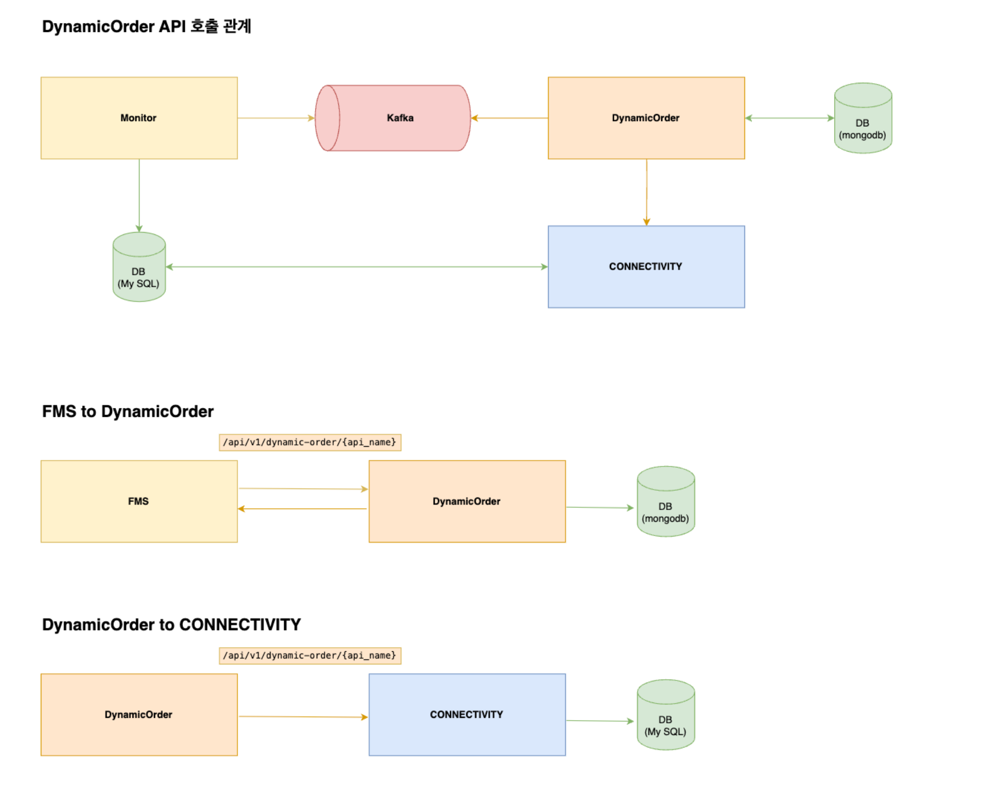

# fms-dynamic-order-api

## 개발 환경
- Java : 21
- Spring Boot : 3.3.0
- Kafka : 3.7.0
- Cloud : AWS, Kubernetes (EKS), MSK (KRaft mode)
- DB: MongoDB (Amazon DocumentDB)
- CI/CD : Github Actions

---

## API 호출 관계

## FMS to DYNAMIC ORDER API

### Release API
* FssMonitor <--> Kafka
* Kafka <--> DynamicOrderApi
* DynamicOrderApi <--> Connectivity: /api/v1/dynamic-order/release

### Config API
* FMS <--> DynamicOrderApi: /api/v1/dynamic-order/config

---

## API 소개
* DEV 서버 Swagger URI - [https://dev-dynamic-order-api.fassto.ai/swagger-ui/index.html](https://dev-dynamic-order-api.fassto.ai/swagger-ui/index.html)
* STG 서버 Swagger URI - [https://stg-dynamic-order-api.fassto.ai/swagger-ui/index.html](https://stg-dynamic-order-api.fassto.ai/swagger-ui/index.html)
* PROD 서버 Swagger URI - [https://prod-dynamic-order-api.fassto.ai/swagger-ui/index.html](https://prod-dynamic-order-api.fassto.ai/swagger-ui/index.html)
* ICD - FMS to Dynamic Order [ICD 문서](https://docs.google.com/document/d/1sfM1YyfMl1cmZMBZ979GBnjNKvJFunq7MS-IEvHxrA8/edit?tab=t.0)# dynamic-order-api
